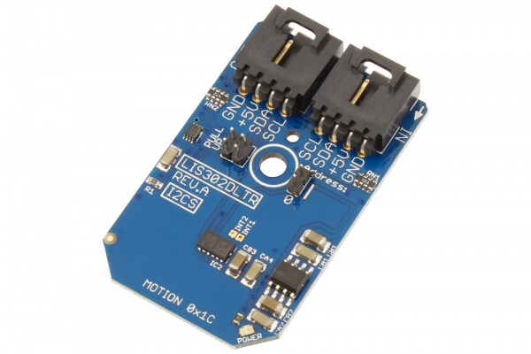

# LIS302DLTR

Manufactured by STMicroelectronics, the LIS302DLTR is a low-power three axis linear accelerometer. The LIS302DLTR has dynamically user selectable full scales of ±2g/±8g and it is capable of measuring accelerations with an output data rate of 100 Hz or 400 Hz. A self-test capability allows the user to check the functioning of the sensor in the final application.
This Device is available from www.ncd.io 

[SKU: LIS302DLTR_I2CS]

(https://store.ncd.io/product/lis302dltr-mems-motion-sensor-3-axis-%C2%B12g%C2%B18g-smart-digital-output-piccolo-accelerometer-i2c-mini-module/)
This Sample code can be used with Arduino.

Hardware needed to interface LIS302DLTR sensor with Arduino

1. <a href="https://store.ncd.io/product/i2c-shield-for-arduino-nano/">Arduino Nano</a>

2. <a href="https://store.ncd.io/product/i2c-shield-for-arduino-micro-with-i2c-expansion-port/">Arduino Micro</a>

3. <a href="https://store.ncd.io/product/i2c-shield-for-arduino-uno/">Arduino uno</a>

4. <a href="https://store.ncd.io/product/dual-i2c-shield-for-arduino-due-with-modular-communications-interface/">Arduino Due</a>

5. <a href="https://store.ncd.io/product/lis302dltr-mems-motion-sensor-3-axis-%C2%B12g%C2%B18g-smart-digital-output-piccolo-accelerometer-i2c-mini-module/">LIS302DLTR 3Axis Motion and "Piccolo" Accelometer Sensor</a>

6. <a href="https://store.ncd.io/product/i%C2%B2c-cable/">I2C Cable</a>

LIS302DLTR:

Manufactured by STMicroelectronics, the LIS302DLTR is a low-power three axis linear accelerometer. The LIS302DLTR has dynamically user selectable full scales of ±2g/±8g and it is capable of measuring accelerations with an output data rate of 100 Hz or 400 Hz. A self-test capability allows the user to check the functioning of the sensor in the final application.

Applications:

• Free-fall detection

• Motion activated functions

• Gaming and virtual reality input devices

• Vibration monitoring and compensation, etc.

How to Use the LIS302DLTR Arduino Library

The LIS302DLTR has a number of settings, which can be configured based on user requirements.
          
1.Data rate setting:The following command is used to set the data rate.

           lis.setAccelDataRate(ACCEL_DATARATE_100HZ);             // AODR (Hz): 100
            
2.Accleration range selection:The following command is used to select the range of acceleration.

           lis.setAccelRange(ACCEL_RANGE_2G);                      // ±2 G
              
